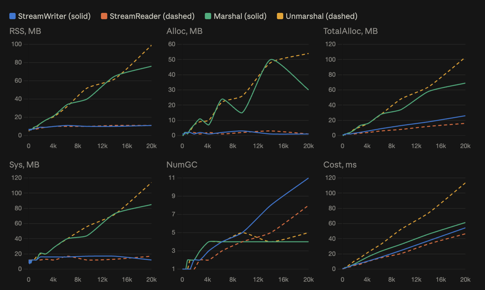

# json-streaming

Streaming read/write for JSON arrays with constant memory usage.

- **Writer** emits an array element-by-element into an `io.Writer` through a fixed-size buffer.
- **Reader** pulls elements one at a time from an `io.Reader` into a caller-owned destination.
- Neither side accumulates elements internally — memory is bounded by the writer's flush buffer and the size of a single JSON element.
- Backed by [`goccy/go-json`](https://github.com/goccy/go-json) for ~3× throughput over `encoding/json` at the same allocation profile.

Comparison of standard library and library streams.



## Install

```sh
go get github.com/ValeryVerkhoturov/json-streaming
```

Requires Go 1.19+.

## Writing

Drain rows from a channel into the writer:

```go
// source <-chan Row
sw, err := jsonstreaming.NewStreamWriter(w)
if err != nil {
    return err
}
var row Row
for r := range source {
    row = r
    if err := sw.SetRow(&row); err != nil {
        return err
    }
}
return sw.Flush()
```

Options:

- `WithBufferSize(n int)` — override the flush buffer (default 1 MiB).
- `WithFields(names ...string)` — project each row to only the named top-level JSON fields. Given `{"id":1,"name":"a","secret":"x"}` and `WithFields("id","name")`, emits `{"id":1,"name":"a"}`. Costs a bounded `[]byte` alloc per row.

### With cancellation

`select` lets cancellation preempt a blocked channel receive:

```go
sw, err := jsonstreaming.NewStreamWriter(w)
if err != nil {
    return err
}
var row Row
for {
    select {
    case <-ctx.Done():
        return ctx.Err()
    case r, ok := <-source:
        if !ok {
            return sw.Flush()
        }
        row = r
        if err := sw.SetRow(&row); err != nil {
            return err
        }
    }
}
```

## Reading

Fan decoded rows out to a channel:

```go
// sink chan<- Row
sr, err := jsonstreaming.NewStreamReader(r)
if err != nil {
    return err
}
defer sr.Close()

var row Row
for sr.Next() {
    if err := sr.Decode(&row); err != nil {
        return err
    }
    sink <- row // reusing &row keeps allocations bounded
}
return sr.Err()
```

### With cancellation

`select` on the send preempts a slow consumer:

```go
sr, err := jsonstreaming.NewStreamReader(r)
if err != nil {
    return err
}
defer sr.Close()

var row Row
for sr.Next() {
    if err := sr.Decode(&row); err != nil {
        return err
    }
    select {
    case <-ctx.Done():
        return ctx.Err()
    case sink <- row:
    }
}
return sr.Err()
```

## Wrapping a stream in a JSON object

`MarshalStream` writes a struct as a JSON object; any field whose kind is `chan` (with receive direction) is streamed as a JSON array, receiving until the channel closes. Every other field goes through the normal codec.

Unlike the primitives, `MarshalStream` takes a `context.Context` — the library drives the channel receive internally, so cancellation cannot come from outside. Cancelling `ctx` preempts a stalled producer (via `reflect.Select`) and any pending write to `w`.

```go
type Response struct {
    Status string     `json:"status"`
    Rows   <-chan Row `json:"rows"`
    Total  int        `json:"total"`
}

ch := make(chan Row)
go func() {
    defer close(ch)
    for _, r := range source {
        select {
        case <-ctx.Done():
            return
        case ch <- r:
        }
    }
}()

m := jsonstreaming.NewMarshaler()
return m.MarshalStream(ctx, w, Response{Status: "ok", Rows: ch, Total: len(source)})
// {"status":"ok","rows":[{"id":1,...},{"id":2,...},...],"total":N}
```

Reuse one `*Marshaler` across many calls to share the configured buffer. Options:

- `WithMarshalerBufferSize(n int)` — override the flush buffer (default 1 MiB, `DefaultBufferSize`).

The package-level `jsonstreaming.MarshalStream(ctx, w, v)` is a shorthand for `NewMarshaler().MarshalStream(ctx, w, v)` — same behaviour with defaults.

Field names come from `json:"..."` tags; `,omitempty` (via `reflect.Value.IsZero`) and `-` are honored. A nil channel emits `[]`.

## Memory model

Reusing the same destination pointer across `SetRow` / `Decode` calls keeps per-row work in already-owned memory. The writer never buffers more than `bufSize` bytes before flushing; the reader's internal buffer grows only to the size of the largest single element.
